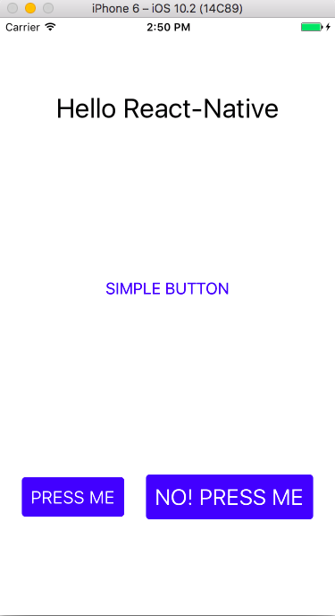

# React Native - Guess that Song


## Bio

__Tim Garcia__


* Computer Science undergrad @ UC Riverside, masters @ Georgia Tech
* 5 years @ Amazon working on different kindle products (kindle readers, kindle fire table, kindle cloud reader, etc)
* 3 Years teaching at Web Development Bootcamps
* Co-founder and Lead Instructor at [Rithm School](https://www.rithmschool.com).

__Contact__: Please get in touch!

* tim@rithmschool.com
* [@timgarcia0](https://twitter.com/TimGarcia0)


### Objectives

1. Why React Native?
2. Setup react-native toolchain, and walk through the files in a new application
3. Create scene with basic react native components (Text, View, Button, TouchableOpacity)
4. Get familiar with styling in react native (flex, flexDirection, justifyContent, alignItems)
5. Use props, state to make app welcome page
6. Debug your react-native app
7. Practice ES2015 syntax for classes, import, arrow functions, const, let, string templates, spread operator 
8. Use lifecycle events like `componentDidMount`, `componentWillUnmount`, and `shouldComponentUpdate`
9. Understand the state of navigation in react-native and implement navigation with react-nativation

## React Native

React native is a library for creating native applications.  It allows developers to write JS code that produces iOS and Android binaries.  It was first announced to the world in March 2015 and has been changing and growing in popularity at high speeds

### Why React Native?

__Advantages__

* Shared code between iOS and Android
* More JS developers available than native developers
* Faster iteration when developing (hot reloading, easier to reason about state)
* Can prototype quickly

__Disadvantages__

* Not as performant as native
* Fast paced community.  Lots of change


## Toolchain Setup

The [react native docs](https://facebook.github.io/react-native/docs/getting-started.html) have a great break down of what to do on each platform.  Here are the highlights:

__For Everyone__:

* Install [nodejs](https://nodejs.org/en/)
* Run `npm install -g react-native-cli` to install the command line tool for react native
* Run `brew install node && brew install watchman` (On mac)

__iOS__:

* Make sure you have xcode installed.  If you do not, start downloading now!!

__Android__:

* Download and install android studio.  Follow the direction in the facebook docs.

## First App!


In your terminal, run:

```
react-native init SongGuessingGame
```

Note that `SongGuessingGame` is the name of our project and can be anything.

### Important Files

The cli will create a folder and install the files you need inside.  Here are some important ones:

* __package.json__: Lists our javascript dependencies.  This is what gets edited when you do `npm install --save <module_name>`
* __index.ios.js__: The entry point to our ios app.  We can put ios specific setup here.
* __index.android.js__: The entry point to our android app.  Android specific setup can go here
* __.babelrc__: The config file for babel (a transpiling library)
* __.flowconfig__: Flow is a static type checker than you can use in your app.  Find out more from [facebook](https://flowtype.org/)
* __node_modules__: A directory that contains all of our JS dependencies.
* __ios__: A directory that contains build settings for iOS. The xcode project will be found here.
* __android__: A directory that contains build settings for android. The gradle build scrips will be in here.


## Basic Components

React native does not use the DOM, so no html.  Instead we must use native components.  We'll start with:

* __Text__: For putting text on the screen
* __View__: A generic component that holds other components
* __Button__: A non customizable button that attempts to look and feel like a native on iOS and android.
* __TouchableOpacity__:  A touchable wrapper that is typically used to make custom buttons

Take a look at the code that was generated in _index.ios.js_ (or similarly in _index.android.js_).  Try to figure out what it does:

```js
import React, { Component } from 'react';
import {
  AppRegistry,
  StyleSheet,
  Text,
  View
} from 'react-native';

export default class SongGuessingGame extends Component {
  render() {
    return (
      <View style={styles.container}>
        <Text style={styles.welcome}>
          Welcome to React Native!
        </Text>
        <Text style={styles.instructions}>
          To get started, edit index.ios.js
        </Text>
        <Text style={styles.instructions}>
          Press Cmd+R to reload,{'\n'}
          Cmd+D or shake for dev menu
        </Text>
      </View>
    );
  }
}

const styles = StyleSheet.create({
  container: {
    flex: 1,
    justifyContent: 'center',
    alignItems: 'center',
    backgroundColor: '#F5FCFF',
  },
  welcome: {
    fontSize: 20,
    textAlign: 'center',
    margin: 10,
  },
  instructions: {
    textAlign: 'center',
    color: '#333333',
    marginBottom: 5,
  },
});

AppRegistry.registerComponent('SongGuessingGame', () => SongGuessingGame);
```


### First Component

For our first component, create a directory in the root of your project called `src`. Inside of `src`, create a file called `Welcome.js`.


```js
import React, { Component } from 'react';
import {
  View,
  Text,
  StyleSheet,
} from 'react-native'

export default class Welcome extends Component {
  render() {
    return (
      <View style={styles.container}>
        <Text>Hello React-Native</Text>
      </View>
    );
  }
}

const styles = StyleSheet.create({
  container: {
  }
});
```

Now change your _index.ios.js_ and _index.andriod.js_ to use welcome:

```js
import React, { Component } from 'react';
import { AppRegistry } from 'react-native';
import Welcome from './src/Welcome'

export default class SongGuessingGame extends Component {
  render() {
    return (
      <Welcome />
    );
  }
}

AppRegistry.registerComponent('SongGuessingGame', () => SongGuessingGame);
```


__EXERCISE__

Checkout the `style-exercise` branch:

```
git fetech
git checkout style-exercise
```

Then get the ui to look like the mock up below:



To see a solution:

```
git fetch
git checkout style-exercise-solution
```


## React Native Basics: Props And State

One of the core concepts of react native (and react for the web) is props and state.

* __props__ - data that is passed to a component that cannot be changed by the component (read only)
* __state__ - data that can be changed by a component

In practice, a prop is something that is passed into a component as an attribute.  For example, the button has the props _title_, _onPress_, and _color_:

```
<Button
  title="SIMPLE BUTTON"
  onPress={() => null}
  color="blue"/>
```

In contrast, state is owned by a component and may be changed by that component but by no other components.  If other components need to read state information, the data should be passed to the child component as a prop.

A component's state is defined in the constructor.  In the example, the state property `color` is changed every 2 seconds to a new random color:

```js
import React, { Component } from 'react'
import {Text} from 'react-native'

export default class RandomColor extends Component {
  constructor(props) {
    super(props)
    this.state = {
      color: 'red'
    };
    setInterval(() => {
      const colors = ['red', 'green', 'blue', 'yellow', 'indigo'];
      const color = colors[Math.floor(Math.random()*colors.length)];
      this.setState({color});
    }, 2000);
  }

  render() {
    return <Text style={{color: this.state.color}}>Text Changes Colors</Text>
  } 
}
```

### Creating a Custom Button

Let's create a customized button that we'll use throughout our app.  The button will look similar to our mockup above:

```
git checkout custom-button-starter
```

We'll want to add some styling to the button so that it looks a little nicer.  Let's add the following:

* borderRadius - rounded corners
* backgroundColor - the background of our button
* padding - padding around the text
* color - applied to the text component
* fontSize - applied to the text component

Also, our custom button needs to handle `onPress`.

To see a solution:

```
git checkout custom-button-solution
```

__EXERCISE__

Using 3 components `Welcome`, `GameContainer`, and `Guess` (plus the custom button we just created), make a UI in which the user sees the welcome screen first, then clicks a button to start the game.  The game can just say hello world for now.

Your starter code is at:

```
git checkout start-game-exercise
```

_It's important to pay attention to binding for this example._


And a solution is at:

```
git checkout start-game-solution
```

## Debugging

In the developer menu (Control + D on iOS simulator), there are lots of useful debugging tools

* Reload - does a full reload of the app.  You can also do CMD + R on a mac
* Enable/Disable Remote Debugging - allows you to debug your app in chrome and set break points
* Enable/Disable Live Reload - automatically reloads your app whenever you change a file
* Enable/Disable Hot Reload - tries to swap out the code in one part of your app without a full reload.  This can get confused.  I typically use this when I'm styling
* Inspector - Allows you to see margin, padding, size, etc for components.


## Lifecycle Events

Throughout the lifetime of your react native component, you may want to run code on specific events.  For our app, we will use:

* __componentDidMount__ - common for making http requests
* __componentWillUnMount__ - used to do cleanup. In our case, we will use it to release our playing song resource
* __shouldComponentUpdate__ - used to optimize re-renders.  Typically react is very good at this, so only do this when you are aware that there is an issue.

You can see the complete list of [lifecycle events](https://facebook.github.io/react/docs/react-component.html) in the react docs.

## Native Dependencies

There are many 3rd party npm modules to choose from for react-native.  Many of them take advantage of native components.  To add those components as a dependency, you will usually need to link.  Let's add `react-native-fs` and `react-native-sound` for our song guessing game:

```
npm install --save react-native-fs react-native-sound
```

This command has downloaded the javascript that our react components will depend on, but the native libraries still need to be linked into our app.  To link the libararies:

```
react-native link
```

### Downloading a Random Song

We will be using the itunes affiliate api to download music.  Below is a preset list of song.  Create a file called `SongData.js` and add this class:

```js
export default class SongData {
  static randomSongId() {
    const songIds = ["995535015", "966411602", "823593456", "956689796", "943946671",
                     "982388023", "907242704", "201281527", "656801339", "910038357",
                     "250038575", "878000348",  "794095205",  "1645339",  "400835962",
                     "325618",  "169003415",  "51958108", "192688540", "684811768",
                     "344799464", "217633921", "192811017", "71068886", "640047583",
                     "517438248", "656479859", "310237", "991390352",  "344799727",
                     "162337613", "121695005", "159293848", "305118379",
                     "1193701392" ];

    const id = Math.floor(Math.random() * songIds.length);
    return songIds[id]; 
  }
}
```

Notice a static method is used here just for fun.  It allows us to call `SongData.randomSongId()` without having to create an instance of `SongData`.

#### Fetch

To get JSON data for a song, we need to make a GET request to `https://itunes.apple.com/us/lookup?id=<SONGID>`. In react-native, the `fetch` api is used, which is a javascript standard!  To use fetch, we need to understand promises:

```
const songId = SongData.randomSongId();
fetch(`https://itunes.apple.com/us/lookup?id=${songId}`) // returns promise
      .then(d => d.json()) // gives back an object which we need to convert to json.  
      .then((d) => {
        console.warn(d.results[0]);
        return song;  // returning the song for the next .then method
      });
```

__EXERCISE__

Use the `fetch` api and `RNFS.downloadFile` (docs can be found [here](https://github.com/johanneslumpe/react-native-fs)) to make a GET request to get the song data, then anther GET request to download the audio file.  Once the audio file is download, display the artist and track info. The information that we want from the itunes api is:

* artist
* id
* album
* trackName
* audioUrl

Which lifecycle method would be appropriate for this request?

You can find the solution at:

```
git checkout fetch-song-solution
```
Now, let's take a second to talk about navigation...

## Navigation?


Navigation has been a bit of a community pain point for react native.  Here is a survey of the options:

* __NavigatorIOS__ - part of react-native.  Only supports iOS and doesn't seem to be in future plans __<span style="color:red">NOT RECOMENDED</span>__
* __Navigator__ - Also part of react-native.  Implemented in JS.  Also seems out of favor. __<span style="color:red">NOT RECOMENDED</span>__
* __NavigationExperimental__ - Part of react-native. A popular choice if you are adding redux to your app.  Not recommended if you do not use redux.
* __react-native-navigation__ - A native implementation of navigation from wix.  If you want native components, this is a good bet.
* __ex-navigation__ - Exponent's navigation library.  Popular but not being actively supported.  Instead...
* __react-navigation__ - A new project supported by exponent and facebook. The plan is for react-navigation to replace NavigationExperimental.  Check it out at [https://reactnavigation.org/](https://reactnavigation.org/)

## react-navigation

Offers built in navigators:

* StackNavigator
* TabNavigator

Once your components are inside of a navigator, each component is given [this.props.navigation](https://reactnavigation.org/docs/navigators/navigation-prop)

From `this.props.navigation`, you get access to `this.props.navigation.navigate`, which allows you to programmatically switch between stacks or tabs.  Let's add a `StackNavigator` to our app.

First, install react-navigation:

```
npm install --save react-navigation
```

Next, rewrite `GameContainer`:

```js
import React, { Component } from 'react';
import Welcome from './Welcome';
import Guess from './Guess';
import {StackNavigator} from 'react-navigation';

const GameContainer = StackNavigator({
  Welcome: { screen: Welcome },
  Guess: { screen: Guess }
}, {
  initialRouteName: "Welcome"
});

export default GameContainer;
```

Next, inside of `Welcome`, we need to use `this.props.navigation` to change the screen:

```js
  render() {
    const { navigate } = this.props.navigation;
    return (
      <View style={styles.container}>
        <Text style={styles.welcome}>
          Guess That Song
        </Text>
        <CustomButton
          onPress={() => navigate('Guess')}
          title="Start" />
      </View>
    );
  }
```

That is great!  We can add a title if we like by adding `navigationOptions`.  Inside the class, add:

```
static navigationOptions = {
	title: 'Guess That Song'
}
```

If we don't actually like the header in the stack view, we can get rid of it as well:

```js
import React, { Component } from 'react';
import Welcome from './Welcome';
import Guess from './Guess';
import {StackNavigator} from 'react-navigation';

const GameContainer = StackNavigator({
  Welcome: { screen: Welcome },
  Guess: { screen: Guess }
}, {
  initialRouteName: "Welcome",
  headerMode: "none"
});

export default GameContainer;
```

See the solution at `git checkout first-navigator-solution`

## Playing Sound

To play our sound and get the MVP of our game working, let's create 3 new components:  `Answer`, `GuessInput`, and `PlayHint`:

#### Using TextInput

Let's start with `GuessInput`, its job is to present the user with a input and a button that says guess.  It will be a child component of `Guess` and it will relay change events to the parent component.

Here is some suggested styling for `Guess`:

```
const styles = StyleSheet.create({
  container: {
    flex: 1,
    alignItems: 'center',
    backgroundColor: '#F5FCFF',
  },
  flashMessage: {
    flex: 0.4,
    justifyContent: 'center'
  },
  flashMessageText: {
    color: "red",
    fontSize: 30,
  },
  guessInput: {
    flex: 1,
    justifyContent: 'flex-start',
    alignItems: 'center'
  }
});
```

We will get to some of the style sheets later, for now, you will be using container and guessInput objects.

Here is the style for `GuessInput`:

```
const styles = StyleSheet.create({
  guess: {
    backgroundColor: '#ededed',
    height: 50,
    width: 250,
    marginBottom: 15
  }
});
```

__IMPORTANT__: guess is the style sheet object for a `TextInput`.  On iOS, text inputs must set a height or they will not show up.

A `TextInput` component has two props that we need to provide: `value` and `onChangeText`.  The facebook docs are `TextInput` are [here](https://facebook.github.io/react-native/docs/textinput.html)

__EXERCISE__

Implement a working `GuessInput` component that updates the text in the `TextInput` as the user types.  Also, the GUESS button, should call a function provided as a prop from the `Guess` component to notify the parent that the guess has been submitted.

Solution at:

```
git checkout guess-input-solution
```

#### Playing the Song in `PlayHint`

Next, let's make a component called `PlayHint`. Its job will be to play the downloaded audio as long as there is audio left to play or if the user makes the correct guess.


__QUESTION__

Check out the docs for [react-native-sound](https://github.com/zmxv/react-native-sound).  How should we manage the state of the audio playing?  Keep in mind that we have to call `release` to clean up the playing audio.


Managing state that leaks out into native components is hard.  There is no easy solution.  In this case, I chose to not keep any state in the component.  Rather, I just make sure to clean up when the component is finished.  Here is `PlayHint`:

```js
import React, {Component} from 'react';
import { View } from 'react-native';
import Sound from 'react-native-sound';

export default class PlayHint extends Component {
  constructor(props) {
    super(props);
    this.sound = null;

    this.playCallback = this.playCallback.bind(this);
  }

  // We never want this component to be
  // rerendered
  shouldComponentUpdate() {
    return false;
  }

  // Method for keeping track of when the song is done.
  // Call onSongDone from the passed in props
  playCallback(success) {
    if (success) {
      this.props.onSongDone();
    } else {
      console.warn("Song did not play properly");
    }
  }

  // Start playing the song as soon as the component is
  // mounted.  This only happens 1 time.
  componentDidMount() {
    if (this.sound) {
      this.sound.stop();
      this.sound.release();
    }
    this.sound = new Sound(this.props.audioFile,
      this.props.audioPath,
      (e) => {
        if (e) {
          console.warn('error', e);
        } else {
          this.sound.play(this.playCallback);
        }
    });
  }

  // Make sure to clean up the native audio before
  // the component goes away
  componentWillUnmount() {
    if (this.sound) {
      this.sound.stop();
      this.sound.release();
    }
  }

  // We don't actually need to show anything for this
  render() {
    return (
      <View />
    );
  }
}
```

The code is added in the following branch:

```
git checkout play-sound-starter
```

__EXERCISE__

Now that we have a audio playing component, use it!  The `Guess` component should add the `PlayHint` component to the render method but only if the audio is ready to play.  Do a `console.warn` to tell the user if the song was guessed correctly or not.  I am keeping the following state is `Guess`:

```
this.state = {
  playAudio: false,
  guess: '',
  guessIncorrect: undefined,
  song: {}
}
```

I also have the following methods:

```
this.downloadAndPlaySong = this.downloadAndPlaySong.bind(this);
this.onSongDone = this.onSongDone.bind(this);
this.onChangeGuess = this.onChangeGuess.bind(this);
this.onGuess = this.onGuess.bind(this);
```

You will also need a method to check to see if your guess is correct.  Here is what I did:

```
  verifyGuess(guess) {

    const guesses = guess.trim().toLowerCase().split(/\s+/);
    const answers = `${this.state.song.artist} ${this.state.song.trackName}`
                        .trim().toLowerCase();
    return guesses.reduce(function(acc, g) {
      if (answers.indexOf(g) >= 0) {
        return true;
      }
      return acc;
    }, false);
  }
```

Put these components together so that we can finally here some music!

Solution at:

```
git checkout play-sound-solution
```

## Navigating to Other Navigators (Showing the Answer)

Let's say we want our UI to show a navigation header when we are shown the answer.  The only problem is that we told our StackNavigator not to show a header.  The solution: sub navigators.

Inside of `GameContainer` we can make another navigator for the Answer then use it within our primary navigator:

```js
const AnswerNavigator = StackNavigator({
  Answer: { screen: Answer}
}, {
  initialRouteName: 'Answer'
});

const GameContainer = StackNavigator({
  Welcome: {
    screen: GameWelcome,
  },
  GuessView: {
    screen: GuessView
  },
  AnswerNavigator: {
    screen: AnswerNavigator
  }

}, {
  headerMode: 'none',
  initialRouteName: "Welcome"
});

export default GameContainer;
```

But now we have another problem, we need to pass data to our answer component.  Normally, if the component is in the same navigator, we can use navigate and params:

```
this.props.navigation.navigate('Answer', {artist: 'Tim'})
```

Then inside of our Answer component, we could get those params this way:

```js
const artist = this.props.navigation.state.params.artist;
```

__BUT__ our component isn't in the same navigator, so we have to use a `NavigationAction`.  Here is how it would work in our song game:

```js
showAnswer() {
  const { artist, trackName, album } = this.state.song;
  const { guessIncorrect } = this.state;
  const navigationAction = NavigationActions.navigate({
  routeName: 'AnswerNavigator',
  params: {},

  // navigate can have a nested navigate action that will
  // be run inside the child router
  action: NavigationActions.navigate({
      routeName: 'Answer', 
      params: {artist, trackName, album, guessIncorrect}
    })
  })
  this.props.navigation.dispatch(navigationAction)
}
```

__EXERCISE__

Here is the styling and the view for `Answer`.  Try to figure out how to pass the correct params to `Answer` from `Guess`:

```js
import React, {Component} from 'react'
import {
  View,
  Text,
  Button,
  Image,
  TouchableOpacity,
  StyleSheet
} from 'react-native'
import CustomButton from './CustomButton'

export default class Answer extends Component {
  static navigationOptions = {
    title: "Guess That Song"
  }

  render() {
    const result = guessIncorrect === false ?
      <Text style={styles.correctText}>Correct 👍</Text> :
      <Text style={styles.incorrectText}>Incorrect 👎</Text>;

    return (
      <View style={styles.container}>
        <View style={{marginBottom: 15}}>
          <Text style={{fontSize: 25}}>{result}</Text>
        </View>
        <View style={styles.artistView}>
          <Text style={styles.artistText}>{artist}</Text>
          <Text style={styles.artistText}>{trackName}</Text>
          <Text style={{fontSize:21}}>{album}</Text>
        </View>
        <Image
          style={styles.img}
          source={{uri: 'https://www.publicdomainpictures.net/pictures/130000/velka/musical-notes.jpg'}}
        />
        <CustomButton
          title={"CONTINUE"}
          onPress={() => navigate('Guess')} />
      </View>
    );
  }
}

const styles = StyleSheet.create({
  container: {
    flex: 1,
    justifyContent: 'center',
    alignItems: 'center',
    backgroundColor: '#F5FCFF',
  },
  artistText: {
    fontSize: 25
  },
  artistView: {
    marginBottom: 25,
    alignItems: 'center',
  },
  img: {
    height: 100,
    width: 250,
    marginBottom: 25,
  },
  correctText: {
    fontSize: 25,
    color: 'green',
    marginBottom: 10
  },
  incorrectText: {
    fontSize: 25,
    color: 'red',
    marginBottom: 10
  },
  nextButton: {
    borderRadius: 4,
    backgroundColor: "blue",
    padding:10
  },
  buttonText: {
    color: 'white',
    fontSize: 25
  }
});
```

Solution:

```
git checkout show-answer-solution
```


## What's Next?

* [React native facebook group](https://www.facebook.com/groups/react.native.community/)
* [Awesome React Native](https://github.com/jondot/awesome-react-native)
* [React Native Radio Podcast](https://devchat.tv/react-native-radio)
